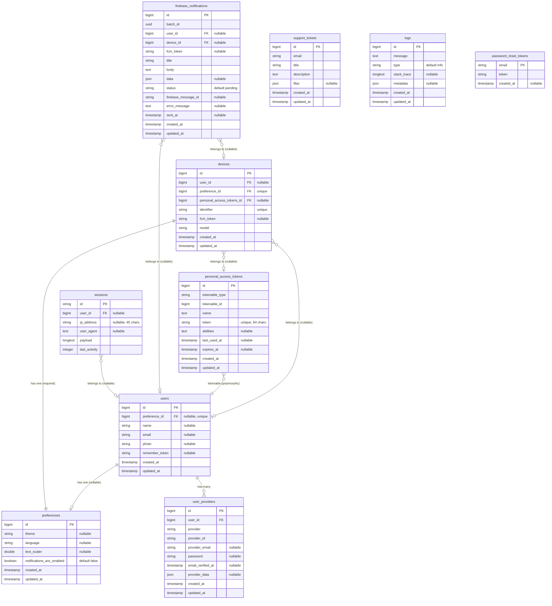

# CLAUDE.md

This file provides guidance to Claude Code (claude.ai/code) when working with code in this repository.

## Project Overview

This is a Flutter mobile application with Laravel backend

- `app/` - Flutter mobile application
- `backend/` - Laravel API backend

## Development Commands

### Flutter App (app/)

**Environment Management:**
```bash
make dev                     # Switch to development environment
make stg                     # Switch to staging environment  
make prod                    # Switch to production environment
```

**Setup and Dependencies:**
```bash
cd app/
fvm flutter pub get          # Install dependencies
make runner                  # Run build_runner (code generation)
```

**Building:**
```bash
make build-android-prod      # Build Android production APK
make build-ios-prod-ipa      # Build iOS production IPA
make build-web-prod          # Build web production
```

**Testing and Quality:**
```bash
fvm flutter test --coverage --test-randomize-ordering-seed random
make lint                    # Run dart fix, format, and analyze
make clean                   # Clean Flutter project
```

**Localization:**
```bash
fvm flutter gen-l10n
```

### Laravel Backend (backend/)

**Development:**
```bash
cd backend/
composer install             # Install PHP dependencies
php artisan storage:link     # Create storage symlink (one time)
php artisan migrate          # Run database migrations
php artisan serve            # Start development server
```

**Development with all services:**
```bash
composer run dev             # Starts server, queue, logs, and vite concurrently
```

**Testing:**
```bash
composer run test            # Clear config and run tests
php artisan test            # Run PHPUnit/Pest tests
```

**Frontend Assets:**
```bash
npm install                  # Install Node dependencies
npm run dev                  # Start Vite development server
npm run build               # Build production assets
```

## Architecture Overview

### Flutter App Architecture

The Flutter app follows **Clean Architecture** with clear separation of concerns:

**Core Layer (`lib/core/`):**
- `config/` - App configuration and environment variables
- `dependencies/` - Dependency injection setup using Provider
- `extensions/` - Dart extensions and utilities
- `theme/` - Material theme configuration
- `utils/` - Utility functions including ApiClient for HTTP requests

**Domain Layer (`lib/domain/`):**
- `entities/` - Business entities (User, Device, Preference)
- `repositories/` - Repository interfaces
- `usecases/` - Business logic use cases
- `enums/` - Domain enumerations

**Data Layer (`lib/data/`):**
- `models/` - Data models that map to/from JSON
- `repositories/` - Repository implementations with API integration
- `services/` - External service integrations (device info, local storage, permissions)

**Presentation Layer (`lib/ui/`):**
- Feature-based organization (auth/, home/, profile/, settings/, etc.)
- Each feature contains screens and related widgets
- State management using Provider pattern

**Key Technologies:**
- State Management: Provider pattern with Provider for dependency injection
- Navigation: GoRouter with authentication-aware routing
- HTTP Client: Custom ApiClient with token management and 401 handling
- Localization support (English/Spanish)
- Environment-based configuration (dev/staging/prod)

### Laravel Backend Architecture

Standard Laravel 12 application structure with API-first design:

**Key Components:**
- `app/Models/` - Eloquent models (User, Device, Preference)
- `app/Http/Controllers/Api/V1/` - Versioned API controllers
- `app/Policies/` - Authorization policies for resource access
- `app/Http/Resources/` - API response transformers
- `database/migrations/` - Database schema definitions
- `routes/api_v1.php` - API route definitions

**API Structure:**
- RESTful API with version prefix (`/api/v1/`)
- Laravel Sanctum for authentication
- Consistent resource naming:
  - `/me` for current authenticated user's resources
  - `/by-identifier` or `/by-device` for anonymous device-based access
- Separate public and protected route groups

### Database Schema

The database schema follows a dual-context design supporting both authenticated users and anonymous devices:



**Core Entity Relationships:**
- Users have an optional one-to-one relationship with preferences
- Devices have a required one-to-one relationship with preferences  
- Devices can optionally belong to a user (supporting anonymous device usage)

**Authentication System:**
- Multiple authentication providers per user via `user_providers`
- Personal access tokens for API authentication (Laravel Sanctum)
- Session management with optional user association

**Notification System:**
- Firebase notifications can target either users or devices directly
- Comprehensive tracking with batch IDs, status, and error handling

**Support Features:**
- Standalone support tickets and application logs
- Password reset tokens for authentication

## API Design Patterns

### Dual-Context Architecture
The API supports both authenticated and anonymous contexts for devices and preferences:

**Anonymous Access (device-based):**
- `GET /devices/by-identifier` - Get device by identifier
- `GET /preferences/by-device` - Get device preferences
- Requires device identifier for access

**Authenticated Access (user-based):**
- `GET /devices/me` - Get current user's device
- `GET /preferences/me` - Get current user's preferences
- Requires Bearer token authentication

### Authentication Flow
1. Users can use the app anonymously with device-based storage
2. When signing in, device gets linked to user account
3. User preferences override device preferences when authenticated
4. Sign out unlinks device but preserves device-based data

## Environment Configuration

### Flutter App Environments

The app supports multiple environments managed through Makefiles:
- Development (`environments/dev/`)
- Staging (`environments/stg/`) 
- Production (`environments/prod/`)

Each environment has its own:
- Firebase configuration files
- Environment JSON files
- Platform-specific manifests

### API Client Configuration

The `ApiClient` class handles HTTP requests with:
- Automatic token management
- 401 unauthorized response handling with callbacks
- Request/response logging with JSON formatting
- Authentication state detection

## Repository Pattern Implementation

All data access follows the repository pattern:

**Repository Interfaces** (`lib/domain/repositories/`):
- Define contracts for data operations
- Abstract away implementation details

**Repository Implementations** (`lib/data/repositories/`):
- `AuthRepositoryImpl` - User authentication via API
- `DeviceRepositoryImpl` - Device management with dual-context support
- `PreferenceRepositoryImpl` - User/device preferences
- `RemoteStorageRepositoryImpl` - File upload to Laravel backend

**Key Pattern:** Repositories automatically choose appropriate endpoints based on authentication state, providing seamless experience for both anonymous and authenticated users.

**Global Session Access:** Use `AppSession.instance` to access current user data globally in repository implementations when needed.

## Key Development Notes

- Use `fvm` (Flutter Version Management) for Flutter commands
- The app uses flavors for different environments with Makefile automation
- Code generation is required for assets and localizations (`make runner`)
- Backend uses Pest for testing framework
- Database relationships: Users have devices, devices have preferences
- Device linking: Devices can be anonymous or linked to authenticated users
- API responses use Laravel Resource classes for consistent formatting